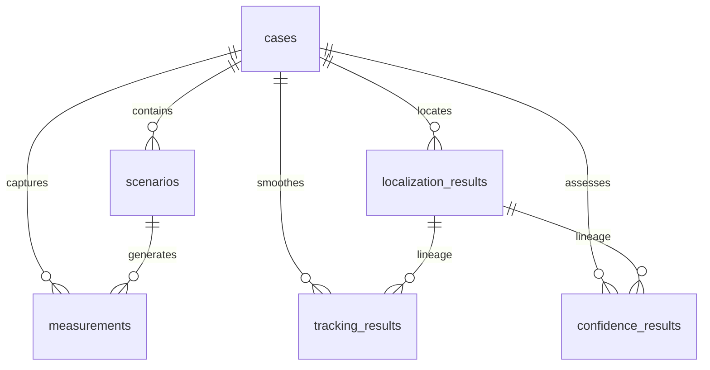

# 📘 Asterion Engineering Handbook
## Week 2 – Scientific Engine Sprint — Master Plan

**Status:** Draft v1.0  
**Sprint:** Week 2 – Scientific Engine Sprint  
**Team:** Sriram (Project Lead / Integration Lead), Chaitanya (Scientific Engineer), Dinesh (Frontend Lead)

---

## Table of Contents

1. [Sprint Overview & Architecture Freeze](#sprint-overview--architecture-freeze)
2. [Team Standards & Ways of Working](#team-standards--ways-of-working)
3. [Database Architecture & Business Identifier Strategy](#database-architecture--business-identifier-strategy)
4. [Day 1 — Measurement Simulator](#day-1--measurement-simulator)
5. [Day 2 — Measurement Validation Engine](#day-2--measurement-validation-engine)
6. [Day 3 — Localization Engine (Core NLLS)](#day-3--localization-engine-core-nlls)
7. [Day 4 — Tracking Engine (Kalman Filter)](#day-4--tracking-engine-kalman-filter)
8. [Day 5 — Confidence & Evidence Engines](#day-5--confidence--evidence-engines)
9. [Day 6 — Pipeline Integration & E2E Testing](#day-6--pipeline-integration--e2e-testing)
10. [Day 7 — Stabilization, Review & Release](#day-7--stabilization-review--release)
11. [Week 2 Release (v0.2.0)](#week-2-release-v020)
12. [Week 3 Readiness Gate](#week-3-readiness-gate)

---

## Sprint Overview & Architecture Freeze

Week 2 of the Asterion project is the **Scientific Engine Sprint**. The core goal is to implement and integrate the complete mathematical and simulation pipeline.

```
Day 1: Measurement Simulator
   ↓
Day 2: Validation Engine
   ↓
Day 3: Localization Engine (NLLS)
   ↓
Day 4: Tracking Engine (Kalman)
   ↓
Day 5: Confidence & Evidence Engines
   ↓
Day 6: Pipeline Integration & E2E Tests
   ↓
Day 7: Stabilization & Release (v0.2.0)
```

> ### 🛑 Week 2 Architecture Freeze
> **No new algorithms, database tables, REST endpoints, or scientific modules** will be introduced during this sprint. Only implementation of the approved architecture, modules, and API contracts is permitted.

### Dependency Graph

Tasks flow strictly downwards. No service or API layer should be started before the underlying scientific module and database tables are verified:

```
Scientific Engine Module (Python Package)
   ↓
Database Migrations & Models
   ↓
Service Layer & Repositories
   ↓
REST APIs (Router Contracts)
   ↓
Frontend Integration Layer (Zustand, API Client, Types)
```

---

## Team Standards & Ways of Working

These guidelines ensure high quality, rapid integration, and code consistency.

### Daily Stand-up (15 minutes, every morning)
Fixed agenda:
1. What did you finish yesterday?
2. What will you do today?
3. Are you blocked?

### Coding Standards
* **Max function length:** ~40 lines (split if longer)
* **Max file length:** ~300 lines (split into modules if longer)
* **Naming conventions:** `snake_case` for Python, `camelCase` for TypeScript/JS, `PascalCase` for React components and Pydantic/ORM models
* **Import order:** standard library → third-party (numpy, scipy, etc.) → local imports, each group alphabetized

### Testing Strategy
* **Backend Framework:** `pytest`
* **Coverage Expectation:** Every new endpoint must have at least one happy-path and one failure-path test. Every scientific module must include comprehensive unit tests.
* **Target:** Increase automated unit and integration test coverage for all newly implemented scientific modules.

### API Contract Freeze
> ### 🔒 API Contract Freeze (effective upon Day 1 endpoint definitions)
> The API surface (endpoints, request/response models, validation rules) for the new routes is **frozen** once introduced on their respective days. Only internal execution logic and performance optimizations are permitted without formal CTO review.

### Frontend Scope Restriction
To remain aligned with the Engineering Blueprint, the frontend role is restricted strictly to preparation.
* **❌ FORBIDDEN in Week 2:** Interactive maps, heatmaps, charts, timeline UI, scientific visualizations, or final dashboard layout polish.
* **✅ PERMITTED in Week 2:** TypeScript type definitions matching backend contracts, Axios API client services, Zustand stores, static/placeholder info cards, loading skeletons, and error screens.

---

## Database Architecture & Business Identifier Strategy

To align with the case-centric investigation workflow, all scientific results persist relative to an investigation **Case**, and carry computational lineage tracking.

### Business Identifier Strategy
All APIs expose and accept human-readable string codes (`CASE-001`, `SCN-001`, `MEAS-001`), which are translated internally by the backend to auto-incrementing database integer primary keys (`id`). Exposing raw database integer keys externally is forbidden.

### Table Relational Schema



| Table | Column | Type | Constraints / References | Description |
|---|---|---|---|---|
| **scenarios** | `id`<br>`case_id`<br>`scenario_code`<br>`name`<br>`description` | INT<br>INT<br>VARCHAR<br>VARCHAR<br>TEXT | PRIMARY KEY<br>FOREIGN KEY (`cases.id`) ON DELETE CASCADE<br>UNIQUE, NOT NULL<br>NOT NULL<br>NULLABLE | Links to parent investigation. |
| **measurements** | `id`<br>`case_id`<br>`scenario_id`<br>`measurement_code`<br>`timestamp`<br>`rssi_dbm`<br>`latitude`<br>`longitude`<br>`timing_advance`<br>`uncertainty_m` | INT<br>INT<br>INT<br>VARCHAR<br>DATETIME<br>FLOAT<br>FLOAT<br>FLOAT<br>FLOAT<br>FLOAT | PRIMARY KEY<br>FOREIGN KEY (`cases.id`) ON DELETE CASCADE<br>FOREIGN KEY (`scenarios.id`) ON DELETE CASCADE<br>UNIQUE, NOT NULL<br>NOT NULL<br>NOT NULL (-150.0 to 0.0)<br>NULLABLE (-90.0 to 90.0)<br>NULLABLE (-180.0 to 180.0)<br>NULLABLE<br>NULLABLE | Captured signal logs. |
| **localization_results** | `id`<br>`case_id`<br>`algorithm`<br>`estimated_latitude`<br>`estimated_longitude`<br>`error_m`<br>`computation_time_ms`<br>`signals_used`<br>`timestamp` | INT<br>INT<br>VARCHAR<br>FLOAT<br>FLOAT<br>FLOAT<br>FLOAT<br>INT<br>DATETIME | PRIMARY KEY<br>FOREIGN KEY (`cases.id`) ON DELETE CASCADE<br>NOT NULL ("multilateration", "kalman", etc.)<br>NOT NULL<br>NOT NULL<br>NULLABLE (meters error)<br>NULLABLE<br>NOT NULL<br>NOT NULL | Position estimates. |
| **tracking_results** | `id`<br>`case_id`<br>`localization_result_id`<br>`step`<br>`latitude`<br>`longitude`<br>`velocity_lat`<br>`velocity_lon`<br>`timestamp` | INT<br>INT<br>INT<br>INT<br>FLOAT<br>FLOAT<br>FLOAT<br>FLOAT<br>DATETIME | PRIMARY KEY<br>FOREIGN KEY (`cases.id`) ON DELETE CASCADE<br>FOREIGN KEY (`localization_results.id`) ON DELETE CASCADE<br>NOT NULL<br>NOT NULL<br>NOT NULL<br>NOT NULL<br>NOT NULL<br>NOT NULL | Smoothed sequential paths. |
| **confidence_results** | `id`<br>`case_id`<br>`localization_result_id`<br>`confidence_score`<br>`confidence_level`<br>`error_ellipse_semi_major_m`<br>`error_ellipse_semi_minor_m`<br>`error_ellipse_orientation_deg`<br>`gdop`<br>`method`<br>`timestamp` | INT<br>INT<br>INT<br>FLOAT<br>VARCHAR<br>FLOAT<br>FLOAT<br>FLOAT<br>FLOAT<br>VARCHAR<br>DATETIME | PRIMARY KEY<br>FOREIGN KEY (`cases.id`) ON DELETE CASCADE<br>FOREIGN KEY (`localization_results.id`) ON DELETE CASCADE<br>NOT NULL (0.0 to 1.0)<br>NOT NULL ("high", "medium", "low")<br>NULLABLE<br>NULLABLE<br>NULLABLE<br>NULLABLE<br>NOT NULL ("gdop", "covariance", etc.)<br>NOT NULL | Confidence metric assessments. |

---

## Day 1 — Measurement Simulator

### Objectives
Build the core simulated signal propagation logic to generate synthetic cell tower measurements from a scenario configuration.

```
ScenarioConfig → RSSI Signal Generator → Noise Model → Measurement Synthesizer
```

### Deliverables
* **Scientific:** RSSI Signal Generator, Noise Model, and Measurement Synthesizer modules implemented and tested.
* **Backend:** `measurements` ORM model, database migrations, repository, service layer, and skeleton API endpoint for `/simulation/generate`.
* **Frontend:** TypeScript models for simulation inputs/outputs, and Zustand store setup.

---

### 👨‍💻 Sriram — Project Lead
| Task | Description | Est. Time |
|---|---|---|
| 1. DB Model | Create `backend/app/models/measurement.py` with foreign keys to Cases and Scenarios, mapping the final database schema | 40 min |
| 2. Migration | Generate and apply Alembic migration for the `measurements` table; verify database up/down scripts | 30 min |
| 3. Repository | Implement `MeasurementRepository` to batch insert and retrieve measurements for a specific case code | 45 min |
| 4. Service | Implement `MeasurementService.generate_measurements` to call Chaitanya's engine, parse output, translate identifiers, and save to DB | 45 min |
| 5. Router | Create endpoint `POST /api/v1/simulation/generate` using request schema `SimulationParameters` and returning generated measurements | 40 min |
| 6. Unit Tests | Write tests for database storage, identifier mapping, and API contract success/failure paths | 40 min |

**Estimated total:** ~4 hours

### 👨‍🔬 Chaitanya — Scientific Engineer
| Task | Description | Est. Time |
|---|---|---|
| 1. RSSI Generator | Create `scientific/simulation/rssi_generator.py` implementing the log-distance path-loss model using geodesy constants | 60 min |
| 2. Noise Model | Create `scientific/simulation/noise_model.py` with AWGN Gaussian noise, shadow fading, seed support, and bounding limits | 45 min |
| 3. Synthesizer | Create `scientific/simulation/measurement_generator.py` orchestrating propagation & noise to output `Measurement` batches | 60 min |
| 4. Unit Tests | Write standalone pytest unit tests verifying signal values, noise distributions, seed reproducibility, and edge cases | 45 min |

**Estimated total:** ~3.5 hours

### 👨‍💻 Dinesh — Frontend Lead
| Task | Description | Est. Time |
|---|---|---|
| 1. Interfaces | Create TS interfaces for `TowerPlacement`, `PropagationDefaults`, `SimulationParameters`, and `Measurement` in `frontend/src/types/` | 30 min |
| 2. Service Layer | Add Axios requests for `POST /simulation/generate` in `frontend/src/services/simulationService.ts` | 30 min |
| 3. Store | Set up Zustand store in `simulationStore.ts` to manage simulation parameters and generated measurement states | 45 min |
| 4. Placeholder UI | Create a static table card in `frontend/src/pages/Scenarios.tsx` displaying the generated measurements (static columns only) | 45 min |

**Estimated total:** ~2.5 hours

### Expected Repository Status
```text
backend/app/models/measurement.py
backend/app/repositories/measurement_repository.py
backend/app/services/measurement_service.py
backend/app/api/v1/routers/simulation.py
scientific/simulation/rssi_generator.py
scientific/simulation/noise_model.py
scientific/simulation/measurement_generator.py
frontend/src/types/scientific.ts
frontend/src/services/simulationService.ts
```

### Git Commits
* `feat(db): add measurements table and migrations`
* `feat(simulation): implement simulation generate router skeleton`
* `feat(simulation): implement RSSI path-loss generator`
* `feat(simulation): add simulation noise model`
* `feat(frontend): create simulation API integration and types`

### Day 1 Smoke Tests
* **Backend:** `/api/v1/simulation/generate` skeleton accepts input and registers in Swagger.
* **Scientific:** Test suite passes; RSSI values correctly decay over distance.
* **Database:** `measurements` table can hold records with foreign keys and WGS84 floats.
* **Docker:** Docker compose builds and launches backend and frontend successfully.

### Day 1 Exit Gate
1. All scientific tests pass (RSSI calculations within physically realistic boundaries).
2. Swagger successfully documents the `/simulation/generate` endpoint structure.
3. The frontend TS types compile without errors.

---

## Day 2 — Measurement Validation Engine

### Objectives
Ensure all telecom measurements pass geometric, RF, and temporal checks before being admitted into localization solvers. Reject corrupted or outlier inputs with detailed messages.

```
Raw Measurements → Measurement Validation Engine → Filtered Measurements / Error Log
```

### Deliverables
* **Scientific:** Implement validation checks (RSSI range, GPS coordinates bounds, Timing Advance sanity, duplicate records) in the scientific package.
* **Backend:** Implement the `POST /measurements/validate` endpoint, routing requests to the scientific validators, logging invalid measurements, and returning structured errors.
* **Frontend:** Implement validation API clients, Zustand state stores for errors, and validation log cards.

---

### 👨‍🔬 Chaitanya — Scientific Engineer
| Task | Description | Est. Time |
|---|---|---|
| 1. Validation Logic | Expand `scientific/validation/validators.py` to validate coordinates, RSSI ranges, missing values, and duplicate records | 60 min |
| 2. Geodesy Bounds | Add WGS84 spatial bounds verification to ensure coordinates are inside expected operational areas | 30 min |
| 3. RF Consistency | Implement cross-checks (e.g., Timing Advance distance must not conflict wildly with RSSI signal decay models) | 45 min |
| 4. Unit Tests | Write comprehensive validation tests (duplicate timestamps, out-of-bounds RSSI, coordinate failures) | 45 min |

**Estimated total:** ~3 hours

### 👨‍💻 Sriram — Project Lead
| Task | Description | Est. Time |
|---|---|---|
| 1. API Endpoint | Create route `POST /api/v1/measurements/validate` accepting a list of measurements and returning validation results | 40 min |
| 2. Service Layer | Implement service logic calling scientific validators, filtering results, and translating codes | 45 min |
| 3. Exception Mapping | Map scientific validation errors to standardized API error models (rejection reasons, bad fields) | 30 min |
| 4. Integration Tests | Write tests verifying that invalid batches return HTTP 422 with structured rejection matrices | 45 min |

**Estimated total:** ~2.7 hours

### 👨‍💻 Dinesh — Frontend Lead
| Task | Description | Est. Time |
|---|---|---|
| 1. Client Service | Create Axios service client for `POST /measurements/validate` | 30 min |
| 2. Validation Store | Add Zustand store for validation results, containing validation states (Valid/Invalid, rejected count, warnings) | 40 min |
| 3. Status Panel | Implement a static validation summary card (showing items validated, items rejected, and a list of structured errors) | 50 min |

**Estimated total:** ~2 hours

### Expected Repository Status
```text
scientific/validation/validators.py (modified with new rules)
backend/app/api/v1/routers/measurements.py
frontend/src/services/measurementService.ts
frontend/src/components/validation/ValidationSummary.tsx
```

### Git Commits
* `feat(validation): add coordinates and RF bounds validation`
* `feat(validation): implement measurements validation router`
* `feat(frontend): create measurement validation store and UI cards`

### Day 2 Smoke Tests
* **Backend:** `/api/v1/measurements/validate` returns `success: false` and a list of error reasons when fed RSSI values of `+10` or coordinate lists with coordinates out of bounds.
* **Scientific:** Unit tests verify correct validation status classifications.
* **Swagger:** Swagger endpoint loads and validation schema is viewable.

### Day 2 Exit Gate
1. Validation API matches the frozen contract.
2. Invalid measurements are flagged and logged, while valid records pass cleanly.

---

## Day 3 — Localization Engine (Core NLLS)

### Objectives
Implement the core mathematical multilateration algorithm utilizing Non-Linear Least Squares (NLLS) optimized via Levenberg-Marquardt, using initial position estimates (such as signal-strength weighted calculations) as optimizer guesses.

```
Validated Measurements → Initial Guess Generator → NLLS Solver (scipy) → Localization Result
```

### Deliverables
* **Scientific:** Implement NLLS optimization and initial position estimation modules.
* **Backend:** `localization_results` ORM models, migration files, repository, service layer, and `POST /localization/run` REST API.
* **Frontend:** API clients and placeholder Localization Result Cards displaying metrics.

---

### 👨‍🔬 Chaitanya — Scientific Engineer
| Task | Description | Est. Time |
|---|---|---|
| 1. Initial Guess | Create initial position estimation logic (such as weighted centroid calculation) to provide starting guesses for NLLS optimization | 60 min |
| 2. NLLS Solver | Create `scientific/pipeline/multilateration.py` implementing solver optimization using `scipy.optimize.least_squares` | 90 min |
| 3. Cost Function | Write residual cost equations (`estimated_distance` - `computed_model_distance`) | 45 min |
| 4. Unit Tests | Write mathematical tests checking known geometric coordinates, ensuring convergence, and confirming initial guess accuracy | 45 min |

**Estimated total:** ~4 hours

### 👨‍💻 Sriram — Project Lead
| Task | Description | Est. Time |
|---|---|---|
| 1. DB Model | Create `backend/app/models/localization_result.py` with foreign key relations linking back to Cases | 40 min |
| 2. Migration | Generate and run database migrations to create the `localization_results` table | 30 min |
| 3. Repository | Implement `LocalizationResultRepository` supporting writes and case-based retrieval | 45 min |
| 4. Service Layer | Build `LocalizationService` that converts data models, calls NLLS solver, calculates error metrics, and persists results | 45 min |
| 5. API Router | Implement `POST /api/v1/localization/run` returning computed coordinates, signal count, and execution time | 40 min |
| 6. Unit Tests | Write integration tests checking mathematical results, database persistence, and API model conformance | 40 min |

**Estimated total:** ~4 hours

### 👨‍💻 Dinesh — Frontend Lead
| Task | Description | Est. Time |
|---|---|---|
| 1. Types | Define TS contracts for `LocalizationResult` matching backend schemas | 25 min |
| 2. API Integration | Add Axios mapping for `POST /localization/run` in `frontend/src/services/localizationService.ts` | 30 min |
| 3. Results Store | Implement Zustand store for localization positions, execution status, and computation times | 40 min |
| 4. Placeholder Card | Create a static result card displaying latitude, longitude, error distance (m), signals used, and time elapsed | 45 min |

**Estimated total:** ~2.3 hours

### Expected Repository Status
```text
scientific/pipeline/multilateration.py
backend/app/models/localization_result.py
backend/app/repositories/localization_repository.py
backend/app/services/localization_service.py
backend/app/api/v1/routers/localization.py
frontend/src/services/localizationService.ts
```

### Git Commits
* `feat(localization): add weighted centroid guess logic`
* `feat(localization): implement NLLS multilateration solver`
* `feat(db): add localization results DB schema and migrations`
* `feat(localization): implement localization execution API`
* `feat(frontend): create localization API client and static cards`

### Day 3 Smoke Tests
* **Scientific:** Solver converges on prepared validation scenarios, producing stable estimates for predefined benchmark scenarios.
* **Backend:** `/api/v1/localization/run` runs calculation and records estimated values into SQLite database.
* **Database:** Alembic upgrade succeeds and table constraint relations are active.

### Day 3 Exit Gate
1. Multilateration runs successfully without memory leaks.
2. Coordinates and residuals map correctly into DB models.
3. API returns 201 Created and saves record.

---

## Day 4 — Tracking Engine (Kalman Filter)

### Objectives
Implement sequential path tracking and motion smoothing of localization estimates over time using a 2D constant-velocity Kalman Filter.

```
Localization Results over Time → Kalman Tracker (State Update) → Smoothed Path
```

### Deliverables
* **Scientific:** Kalman Filter matrix mathematical routines (Time Update and Measurement Update).
* **Backend:** `tracking_results` ORM models, migration files, repository, service layer, and `POST /tracking/run` endpoint.
* **Frontend:** API clients, Zustand state stores, and static path coordinate tables.

---

### 👨‍🔬 Chaitanya — Scientific Engineer
| Task | Description | Est. Time |
|---|---|---|
| 1. Kalman Model | Create `scientific/pipeline/kalman_tracker.py` using NumPy. State vector: `[lat, lon, v_lat, v_lon]` | 90 min |
| 2. Predict & Update | Write matrix calculation steps: state transition (A), process covariance (Q), measurement transition (H), measurement noise (R) | 60 min |
| 3. Sequencer | Implement logic to feed chronological localization results to yield a smoothed output array | 45 min |
| 4. Unit Tests | Write unit tests checking constant-velocity paths, tracking convergence, and noise filtering | 45 min |

**Estimated total:** ~4 hours

### 👨‍💻 Sriram — Project Lead
| Task | Description | Est. Time |
|---|---|---|
| 1. DB Model | Create `backend/app/models/tracking_result.py` with foreign keys to `cases` and `localization_results` | 40 min |
| 2. Migration | Generate and apply migration for `tracking_results` table | 30 min |
| 3. Repository | Implement `TrackingResultRepository` supporting writes and case-based retrieval | 40 min |
| 4. Service Layer | Build `TrackingService` orchestrating Kalman filter loops over case results and saving outputs | 45 min |
| 5. API Router | Implement endpoint `POST /api/v1/tracking/run` returning the array of smoothed track coordinates | 40 min |
| 6. Unit Tests | Write API integration tests verifying tracking inputs generate stored smoothed trajectories | 40 min |

**Estimated total:** ~3.9 hours

### 👨‍💻 Dinesh — Frontend Lead
| Task | Description | Est. Time |
|---|---|---|
| 1. Types | Create `TrackingResult` interface definitions | 25 min |
| 2. API Integration | Add Axios mapping for `POST /tracking/run` | 25 min |
| 3. Path Store | Add Zustand store holding the smoothed path coordinates and sequences | 35 min |
| 4. Path List UI | Build a static tabular component showing chronological steps (Step #, Lat, Lon, Velocity estimate) | 45 min |

**Estimated total:** ~2.1 hours

### Expected Repository Status
```text
scientific/pipeline/kalman_tracker.py
backend/app/models/tracking_result.py
backend/app/repositories/tracking_repository.py
backend/app/services/tracking_service.py
backend/app/api/v1/routers/tracking.py
frontend/src/services/trackingService.ts
```

### Git Commits
* `feat(tracking): implement Kalman filter tracker`
* `feat(db): add tracking results database schemas`
* `feat(tracking): implement tracking execution API`
* `feat(frontend): implement tracking client and static tabular views`

### Day 4 Smoke Tests
* **Scientific:** Filter correctly dampens noisy measurement spikes, showing smoother trajectories.
* **Backend:** `/api/v1/tracking/run` accepts historical localization points and saves the smoothed path to `tracking_results`.

### Day 4 Exit Gate
1. Matrix mathematics calculations compile and run without exceptions.
2. Sequential coordinates are written into DB tables.
3. Path lineage to specific localization estimates is preserved.

---

## Day 5 — Confidence & Evidence Engines

### Objectives
Determine reliability scores and spatial error ellipses. Confidence estimation currently uses GDOP-based geometric analysis together with covariance-derived uncertainty. Generate evidence packets mapping validated vs. rejected measurements.

```
Localization Results + Geometry → Confidence Solver → Confidence Ellipse & Evidence packet
```

### Deliverables
* **Scientific:** Confidence Estimator (covariance & geometric checks) and Evidence Generator.
* **Backend:** `confidence_results` ORM models, migrations, service layers, and REST endpoints for `/confidence/run` and `/evidence/{case_id}`.
* **Frontend:** API clients, stores, badge components, and evidence list cards.

---

### 👨‍🔬 Chaitanya — Scientific Engineer
| Task | Description | Est. Time |
|---|---|---|
| 1. Confidence Solver | Create `scientific/pipeline/confidence.py` computing dilution of precision and deriving error ellipse parameters from covariance matrices | 90 min |
| 2. Evidence packets | Create `scientific/pipeline/evidence.py` to synthesize summary JSON records (towers used, measurements accepted, reasons for reject) | 45 min |
| 3. Unit Tests | Test confidence values on collinear setups (high GDOP) vs. equilateral layouts (ideal low GDOP), and verify ellipse orientations | 45 min |

**Estimated total:** ~3 hours

### 👨‍💻 Sriram — Project Lead
| Task | Description | Est. Time |
|---|---|---|
| 1. DB Models | Create `backend/app/models/confidence_result.py` with foreign keys to `cases` and `localization_results` | 40 min |
| 2. Migration | Generate and apply Alembic migrations for `confidence_results` table | 30 min |
| 3. Repositories | Implement repositories for confidence and evidence retrieval | 45 min |
| 4. Service Layer | Create `ConfidenceService` and `EvidenceService` layers that integrate scientific outputs | 45 min |
| 5. API Routers | Implement `POST /api/v1/confidence/run` and `GET /api/v1/evidence/{case_id}` | 50 min |
| 6. Unit Tests | Verify that confidence bounds save to DB, and evidence packets accurately map validation flags | 40 min |

**Estimated total:** ~4.1 hours

### 👨‍💻 Dinesh — Frontend Lead
| Task | Description | Est. Time |
|---|---|---|
| 1. API Services | Map endpoints for confidence runs and evidence retrievals | 30 min |
| 2. State Stores | Create Zustand state stores for confidence results and case evidence profiles | 35 min |
| 3. Confidence UI | Create a static indicator card with confidence score (0-100%), classification badges (High/Medium/Low), and error ellipse fields | 40 min |
| 4. Evidence UI | Implement a static card detailing audit logs: active towers, accepted measurements count, and error checklists | 45 min |

**Estimated total:** ~2.5 hours

### Expected Repository Status
```text
scientific/pipeline/confidence.py
backend/app/models/confidence_result.py
backend/app/repositories/confidence_repository.py
backend/app/services/confidence_service.py
backend/app/api/v1/routers/confidence.py
backend/app/api/v1/routers/evidence.py
frontend/src/services/evidenceService.ts
```

### Git Commits
* `feat(confidence): implement geometric and covariance confidence solver`
* `feat(confidence): implement evidence record builder`
* `feat(db): add confidence results database schemas`
* `feat(confidence): implement confidence and evidence REST endpoints`
* `feat(frontend): implement confidence indicators and evidence audit views`

### Day 5 Smoke Tests
* **Backend:** `/api/v1/confidence/run` calculates scores. `/api/v1/evidence/{case_id}` returns a JSON packet listing validation status details.
* **Scientific:** Geometry and covariance matrices generate consistent confidence parameters.

### Day 5 Exit Gate
1. Confidence calculations are robust to near-singular matrices.
2. Evidence packets list reasons for measurement rejection.
3. Lineage mapping from confidence results to localization results is verified.

---

## Day 6 — Pipeline Integration & E2E Testing

### Objectives
Stitch all scientific engine components into a sequential, end-to-end processing pipeline, verified via automated runner scripts. Connect all backend APIs and frontend mock views.

```
E2E Runner: ScenarioConfig → Validation → NLLS Multilateration → Kalman Filter Tracker → Confidence Engine → Evidence
```

### Deliverables
* **Scientific:** Create the `pipeline/runner.py` package runner to orchestrate the pipeline from end to end.
* **Backend:** Integrate database updates and ensure clean execution of sequential API endpoints.
* **Frontend:** Interconnect all Zustand stores, components, and client APIs to load actual backend pipeline results in placeholder views.

---

### 👨‍🔬 Chaitanya — Scientific Engineer
| Task | Description | Est. Time |
|---|---|---|
| 1. Pipeline Runner | Create `scientific/pipeline/runner.py` orchestrating Simulator → Validation → NLLS → Kalman → Confidence → Evidence | 90 min |
| 2. Benchmark | Write performance scripts to benchmark total run times (ensuring execution is within HLD performance targets: < 2 seconds for localization on the demo dataset) | 45 min |
| 3. Integration Tests| Create `tests/test_week2_pipeline.py` checking the full scientific cycle on sample datasets | 60 min |

**Estimated total:** ~3.2 hours

### 👨‍💻 Sriram — Project Lead
| Task | Description | Est. Time |
|---|---|---|
| 1. Docker Smoke | Verify `docker compose up --build` launches backend, frontend, and SQLite without issues | 45 min |
| 2. E2E Test | Write a comprehensive test pipeline in `tests/api/test_scientific_pipeline.py` verifying that all endpoints run in sequence | 60 min |
| 3. DB Cleanup | Build routine tasks to wipe/seed database tables cleanly during tests | 30 min |
| 4. CI Workflow | Validate GitHub Actions run clean format checks, static types, and backend/root test suites | 30 min |

**Estimated total:** ~2.7 hours

### 👨‍💻 Dinesh — Frontend Lead
| Task | Description | Est. Time |
|---|---|---|
| 1. Store Wiring | Wire stores together: clicking "Generate Simulation" populates measurement tables, validates them, runs localization, Kalman, and updates results | 60 min |
| 2. Alert States | Display warning cards when validation fails or algorithms trigger fallback guesses | 40 min |
| 3. E2E Flow test | Walk through case creation -> scenario load -> pipeline run in browser with console log validation | 50 min |

**Estimated total:** ~2.5 hours

### Expected Repository Status
```text
scientific/pipeline/runner.py
scientific/validation/validators.py
scientific/simulation/measurement_generator.py
tests/test_week2_pipeline.py
tests/api/test_scientific_pipeline.py
frontend/src/stores/pipelineCoordinator.ts
```

### Git Commits
* `feat(pipeline): implement end-to-end pipeline runner`
* `test(pipeline): add API end-to-end scientific pipeline tests`
* `ci: update GitHub Actions integration pipelines`
* `feat(frontend): orchestrate sequential pipeline execution in Zustand stores`

### Day 6 Smoke Tests
* **System:** Executing `pytest` on `tests/api/test_scientific_pipeline.py` runs all components in sequence, updating multiple database rows.
* **Frontend:** Clicking "Run" successfully fetches data from the backend and loads all cards with live API values.
* **Docker:** Docker compose launches services and SQLite connections cleanly.

### Day 6 Exit Gate
1. The complete execution cycle runs successfully from the UI.
2. Clean local installs run without manual settings adjustments.
3. Execution times remain within HLD targets.

---

## Day 7 — Stabilization, Review & Release

### Objectives
Fix remaining bugs, perform final refactoring of scientific models, verify the test suite, update Swagger documentation, and publish release v0.2.0.

### Team Tasks

#### Bug Fixing & Refactoring
Fix issues categorized by priority:
* **P0 (Critical):** Blocks builds or executions (e.g., NumPy matrix dimension mismatches) — fix immediately.
* **P1 (High):** Breaks specific execution routes or saves incorrect values — resolve same day.
* **P2 (Normal):** Minor issues and warnings — clean up before tagging the release.
* **P3 (Low):** Minor styling or wording issues — log to backlog.

#### Code Formatting
All developers run format and build scripts locally before pushing:
```bash
# Python backend & scientific
ruff check .
black .

# React frontend
npm run lint
npm run build
```

#### Documentation Updates
Owners review and update their respective guides:
* **Scientific Engine Docs (`scientific/README.md`):** Updated by Chaitanya with mathematical documentation, solver boundaries, and validation thresholds.
* **API Documentation (Swagger):** Updated by Sriram with example payloads, query fields, and error codes.
* **UI Docs:** Updated by Dinesh documenting Zustand store flows and API client types.
* **CHANGELOG.md:** Updated by Sriram logging all v0.2.0 deliverables.

---

### Sprint Retrospective Questions
Every developer provides answers on:
1. What went well?
2. What slowed us down?
3. What should improve next week?

---

## Week 2 Release (v0.2.0)

**Release Name:** Asterion v0.2.0 — Scientific Engine Release

### Completed Scope
* Measurement Simulator (path-loss, noise, synthesizers)
* Measurement Validation Engine (GPS limits, duplicate records, RF boundaries)
* Localization Engine (NLLS multilateration)
* Tracking Engine (2D Kalman Filter state loops)
* Confidence Engine (Geometric GDOP and covariance ellipses)
* Evidence Engine (Audit matrices and reject lists)
* Case-Centric DB storage & migrations
* Integration and E2E Pipeline runners

### Deferred Scope (Scheduled for Week 3+)
* Interactive maps, timelines, heatmaps, charts
* PDF report generation
* Final CSS styling and UI polish

---

## Week 3 Readiness Gate

To exit Week 2 and start Week 3, the following conditions must be met:

| Checkpoint | Requirement | Status |
|---|---|---|
| **Code Integrity** | Standard setups compile cleanly on fresh machines. | ☐ |
| **API Compliance** | Swagger reflects all 6 endpoints correctly. | ☐ |
| **Tests Coverage** | Automated unit and integration tests for new modules pass. | ☐ |
| **Data Lineage** | Results map to Case IDs and track specific Localization IDs. | ☐ |
| **System Speed** | The pipeline execution runs within HLD performance targets. | ☐ |
| **Branches Clean** | All feature branches are merged and deleted; v0.2.0 tagged on main. | ☐ |

---

*🔬 Asterion Scientific Engine — Week 2 Sprint Plan*
