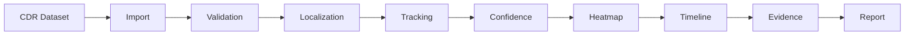
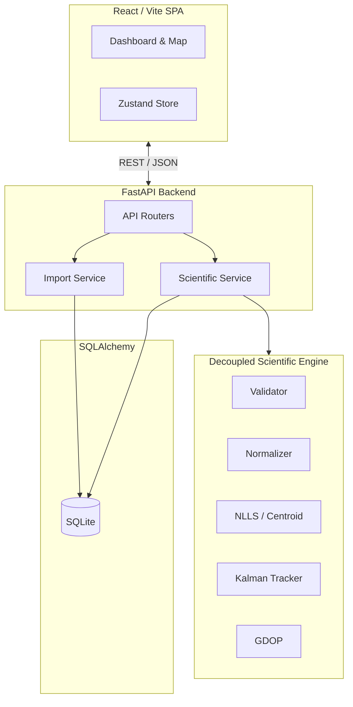
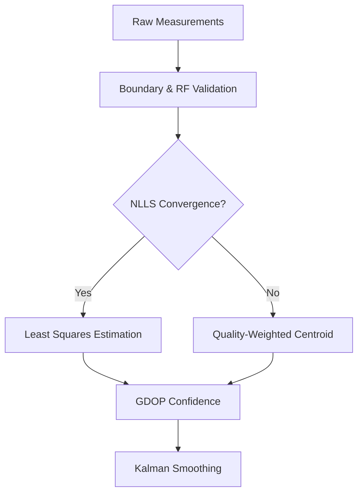

<p align="center">
  <h1 align="center">🛰️ Asterion</h1>
  <p align="center">
    <strong>Explainable telecom investigation platform that reconstructs probable device locations from cellular network measurements while preserving scientific integrity and evidence traceability.</strong>
  </p>
  <p align="center">
    Built for <strong>E-Rakshak 2026</strong>
  </p>
</p>

<p align="center">
  
  
  <a href="LICENSE"></a>
  
  
  
  
  
</p>

<p align="center">
  <!-- TODO: Add a 10-second demo GIF showing Import -> Heatmap -> Timeline -> PDF -->
  
  <br/>
  <em>Import ➔ Heatmap ➔ Timeline ➔ PDF</em>
</p>

> [!NOTE] 
> **Attention Evaluators / Contributors:** The `docs/assets/demo.gif` and other screenshot placeholders in this README require real application screenshots to be captured and uploaded. 

---

## Table of Contents

- [Project Overview](#-project-overview)
- [Why Asterion?](#-why-asterion)
- [Key Features](#-key-features)
- [Dashboard Showcase](#-dashboard-showcase)
- [Example Workflow](#-example-workflow)
- [Problem Statement](#-problem-statement)
- [Solution Overview](#-solution-overview)
- [Architecture](#%EF%B8%8F-architecture)
- [Technology Stack](#-technology-stack)
- [Getting Started](#-getting-started)
- [API Reference](#-api-reference)
- [Scientific Engine](#-scientific-engine)
- [Testing](#-testing)
- [Repository Structure](#-repository-structure)
- [Current Development Status](#-current-development-status)
- [Who Is This For?](#-who-is-this-for)
- [Development Roadmap](#%EF%B8%8F-development-roadmap)
- [Contributing](#-contributing)
- [Team](#-team)
- [License](#-license)

---

## 📌 Project Overview

Asterion is an open-source investigation support platform that demonstrates how multiple cellular tower measurements can be scientifically combined to reconstruct and estimate a device's probable location.

Rather than treating localization as a black box, Asterion emphasizes **explainability and scientific integrity**. If a value (like speed, confidence, or coordinates) cannot be proven by the evidence, Asterion explicitly marks it as **Unknown rather than fabricating** a "clean" output. 

---

## ❓ Why Asterion?

Why build another localization project? Because modern investigations require more than just putting a pin on a map.

* **Explainability:** When an investigator places a suspect at a location, they need to know *why* the system chose that coordinate. 
* **Scientific Honesty:** Commercial tools often silently guess missing data to make a map look cleaner. Asterion rejects this. We prioritize evidence over aesthetics.
* **Evidence Traceability:** Every localization result is cryptographically hashed and tied directly to the original raw CDR row that generated it, ensuring strict chain-of-custody for court readiness.

---

## ⭐ Key Features

* 📍 **Localization:** Non-Linear Least Squares and Quality-Weighted Centroid fallback.
* 🛰 **Kalman Tracking:** 2D constant-velocity state estimation to prevent erratic chronological drift.
* 📈 **GDOP Confidence:** Geometric Dilution of Precision to quantify the reliability of every point.
* 🗺 **Heatmaps:** Multi-factor weighted density visualizations based on dwell time, transitions, and confidence.
* 📄 **Reports:** Court-ready PDF generation with full algorithmic audit trails.
* 🔍 **Evidence Traceability:** Direct cryptographic linkage between input CDRs and output locations.
* ⚖ **Scientific Integrity:** Strict adherence to evidence boundaries; zero data fabrication.
* 🐳 **Docker:** 30-second production-ready containerized deployment.

---

## 📸 Dashboard Showcase

*(Note to maintainers: Replace these placeholders with actual high-res screenshots before presenting.)*

| Dashboard | Heatmap Analysis |
|:---:|:---:|
|  |  |

| Kalman Timeline | Evidence Report |
|:---:|:---:|
|  |  |

---

## 🔄 Example Workflow

From raw data to actionable intelligence in 5 steps:

```text
1. Import CDR Dataset
   ↓
2. Dashboard Visualization
   ↓
3. Execute NLLS Localization
   ↓
4. Calculate GDOP Confidence & Apply Kalman Smoothing
   ↓
5. Review Timeline & Export Court-Ready Report
```

---

## 🚨 Problem Statement

Telecommunication records (CDRs) provide investigators with signal measurements from nearby cellular towers. However, extracting actionable intelligence from these records is extremely difficult.

**Current challenges in telecom-based localization:**

| Challenge | Description |
|-----------|-------------|
| **Large search areas** | Single tower coverage areas span hundreds of meters to several kilometers. |
| **Fabricated Evidence** | Commercial tools often silently guess missing data (like coordinates) to make the map look better. |
| **Measurement noise** | Signal strength varies due to fading, multipath, and environmental factors. |
| **Confidence opacity** | Investigators lack visibility into how reliable an estimated location actually is. |

Asterion addresses these challenges by processing telecom measurements through a rigorous scientific pipeline while maintaining a transparent audit trail.

---

## 💡 Solution Overview

Asterion is an **evidence-first investigation platform**. The platform provides a complete, mathematically defensible workflow.



**Core capabilities (v1.0.0):**
- **Case Management** — Organize investigations with case isolation and duplicate file detection.
- **Data Ingestion** — Import and validate raw operator CDR files.
- **Multilateration** — Estimate position using a Quality-Weighted Centroid and Non-Linear Least Squares.
- **Movement Tracking** — Smooth sequential position estimates and prevent chronological drift using a 2D Kalman Filter.
- **Confidence Estimation** — Quantify reliability using Geometric Dilution of Precision (GDOP) and covariance.
- **Scientific Integrity** — Strict enforcement of `null` state propagation. Unknown towers map to "Unresolved", unknown speed maps to "Unknown".
- **Reporting** — Generate comprehensive, court-ready PDF investigation reports.

---

## 🏗️ Architecture

Asterion utilizes a **Layered Modular Monolith Architecture**, allowing independent development of core subsystems while keeping deployment simple.



**Key architectural decisions:**
- **Decoupled Scientific Engine** — The `scientific/` package operates independently of FastAPI and can be executed standalone for research, notebooks, or batch processing.
- **Repository-Service-Router pattern** — Clean separation of concerns in the FastAPI backend.
- **Strict Data Validation** — Pydantic v2 enforces boundary conditions before any scientific computation begins.

---

## 🧰 Technology Stack

| Layer | Technology | Why Chosen |
|-------|------------|------------|
| **Frontend** | React 19, TypeScript, Vite | Fast compilation, strict typing, and massive ecosystem for geospatial mapping. |
| **Styling** | Tailwind CSS 4 | Zero-runtime CSS extraction for high-performance dashboard UI. |
| **State Management** | Zustand | Boilerplate-free, scalable client-side state without Redux overhead. |
| **Mapping** | Leaflet + React-Leaflet | Open-source, highly customizable geospatial visualization. |
| **Backend** | FastAPI, Uvicorn | High-performance async REST execution for heavy compute endpoints. |
| **ORM** | SQLAlchemy 2, Alembic | Type-safe database interactions and seamless schema migrations. |
| **Scientific** | NumPy, SciPy | Industry-standard vectorized numerical computation and NLLS optimization. |
| **Database** | SQLite | Zero-cost deployment MVP for Hackathon environments. |

---

## 🚀 Getting Started

### Quick Start (30-Second Path)

The fastest way to get Asterion running is via Docker Compose:

```bash
git clone https://github.com/sriram21-09/Asterion.git
cd Asterion
docker compose up --build
```
1. Open `http://localhost:3000`
2. Create a Case
3. Import a dataset
4. You're done!

### Prerequisites

| Requirement | Version | Purpose |
|-------------|---------|---------|
| **Git** | Any recent version | Repository cloning |
| **Python** | 3.11+ | Backend and scientific engine |
| **Node.js** | 20+ | Frontend build tooling |
| **Docker** | Latest (optional) | Containerized deployment |

### Manual Setup (Development)

<details>
<summary><strong>Backend Setup</strong></summary>

```bash
cd backend
python -m venv .venv
# Windows: .venv\Scripts\activate | Unix: source .venv/bin/activate
pip install -r requirements.txt
cp .env.example .env
alembic upgrade head
uvicorn main:app --reload --port 8222
```
</details>

<details>
<summary><strong>Frontend Setup</strong></summary>

```bash
cd frontend
npm install
cp .env.example .env
npm run dev
```
</details>

---

## 📡 API Reference

All REST endpoints are strictly versioned under `/api/v1`. Interactive documentation is available via Swagger UI at `http://localhost:8222/docs` when the server is running.

**Key Endpoints:**
- `POST /api/v1/import` — Upload and parse operator CDR files.
- `POST /api/v1/localization/run` — Run NLLS multilateration.
- `POST /api/v1/tracking/run` — Run Kalman-smoothed position tracking.
- `GET /api/v1/evidence/{case_code}` — Generate a comprehensive audit packet.
- `POST /api/v1/reports/{case_id}/generate` — Generate investigation reports.

---

## 🔬 Scientific Engine

The `scientific/` package is decoupled from the web application framework. 



### Pipeline Components
1. **Validation Engine:** Enforces coordinate bounds, RF constraints, and chronological consistency.
2. **NLLS Multilateration:** Uses `scipy.optimize.least_squares` alongside a Quality-Weighted Centroid fallback.
3. **Kalman Tracker:** A 2D constant-velocity state estimation filter that smooths erratic signal jumps.
4. **Confidence Engine:** Computes Geometric Dilution of Precision (GDOP) and covariance error ellipses.

---

## 🧪 Testing

Asterion maintains a rigorous, continuous testing pipeline. Our test suite does not just optimize for line coverage; it prioritizes algorithmic integrity.

**Tests focus on:**
- ✓ **Scientific correctness**
- ✓ **Boundary validation**
- ✓ **Kalman chronology**
- ✓ **Localization integrity**
- ✓ **Red Team regressions**

```bash
# Run backend tests
cd backend
pytest tests/
```

---

## 📁 Repository Structure

```text
Asterion/
├── backend/                    # FastAPI Python backend
│   ├── alembic/                # Database migration scripts
│   ├── app/
│   │   ├── api/v1/routers/     # REST API route handlers
│   │   ├── database/           # Database session and base models
│   │   ├── models/             # SQLAlchemy ORM models
│   │   ├── repositories/       # Data access layer
│   │   ├── schemas/            # Pydantic request/response schemas
│   │   └── services/           # Business logic layer
│   ├── tests/                  # Backend and red team tests
│   └── main.py                 # Application entry point
│
├── frontend/                   # React + TypeScript + Vite frontend
│   ├── src/
│   │   ├── components/         # Reusable UI components
│   │   ├── pages/              # Route-level page components
│   │   ├── services/           # Axios API client layer
│   │   └── stores/             # Zustand state management
│
├── scientific/                 # Standalone scientific computation engine
│   ├── models/                 # Pydantic domain models
│   ├── pipeline/               # Localization solver pipeline
│   └── validation/             # Domain validators
│
├── datasets/                   # Sample and test datasets (CDR files)
├── docker-compose.yml          # Multi-service orchestration
└── .github/workflows/          # CI/CD pipelines
```

---

## 📊 Current Development Status

> **Current Version:** `v1.0.0` — Production Release 

Asterion v1.0.0 successfully completed a rigorous **Red Team Engineering Audit**, resulting in the complete removal of fabricated metrics and the implementation of a mathematically honest tracking pipeline.

**Core Achievements:**
- ✅ **Null Propagation:** System safely handles unresolved cell towers and unknown speeds without crashing.
- ✅ **Kalman Filter Integrity:** System explicitly rejects chronological impossibilities (negative time deltas).
- ✅ **Idempotent Ingestion:** Prevents duplicate dataset imports per case.
- ✅ **Explainable Dashboard:** The frontend explicitly renders missing data as "N/A" or "Unknown", refusing to display misleading "100% confidence" when data is absent.

---

## 🧑‍💻 Who Is This For?

| Audience | Value |
|----------|-------|
| **Law Enforcement** | Transparent, evidence-backed location estimation for digital investigations |
| **Researchers** | Modular scientific engine for studying multilateration and Kalman smoothing |
| **Students** | Educational platform demonstrating RF signal processing and geospatial analysis |
| **Developers** | Clean, well-documented codebase following modern software engineering practices |

---

## 🗺️ Development Roadmap

### Version 1.0 (Current)
- ✅ Core Localization Engine
- ✅ CDR Import & Validation
- ✅ Kalman Tracking & GDOP Confidence
- ✅ Interactive Dashboard & Report Generation
- ✅ Red Team Scientific Integrity Audit

### Version 1.1 (Future)
- 🔲 **PostgreSQL Migration:** Move from SQLite to PostgreSQL to support heavy concurrent investigations.
- 🔲 **SHA-256 Idempotency:** Upgrade import duplicate detection from filename matching to SHA-256 content hashing.
- 🔲 **Celery Task Queue:** Make long-running imports and report generations fully atomic and asynchronous.

---

## 🤝 Contributing

Contributions are welcome! Please ensure any PRs affecting the `scientific/` engine are backed by mathematical proofs or referential datasets. 

**Scientific contributions require validation, datasets, references, or mathematical justification.**

- Create a feature branch (`feature/your-feature`)
- Ensure tests pass (`pytest`)
- Open a Pull Request.

---

## 👥 Team

| Name | Role | GitHub |
|------|------|--------|
| **Sriram Kasukurthi** | Project Lead / Backend Lead | [@sriram21-09](https://github.com/sriram21-09) |
| **Chaitanya** | Scientific Engineer | [@Chaitanya0806](https://github.com/Chaitanya0806) |
| **Dinesh** | Frontend Lead | [@kdineshveera](https://github.com/kdineshveera) |

---

## 📄 License

This project is licensed under the **MIT License**. See `LICENSE` for details.

---

<p align="center">
  <sub>Built with scientific integrity · Asterion v1.0.0</sub>
</p>
