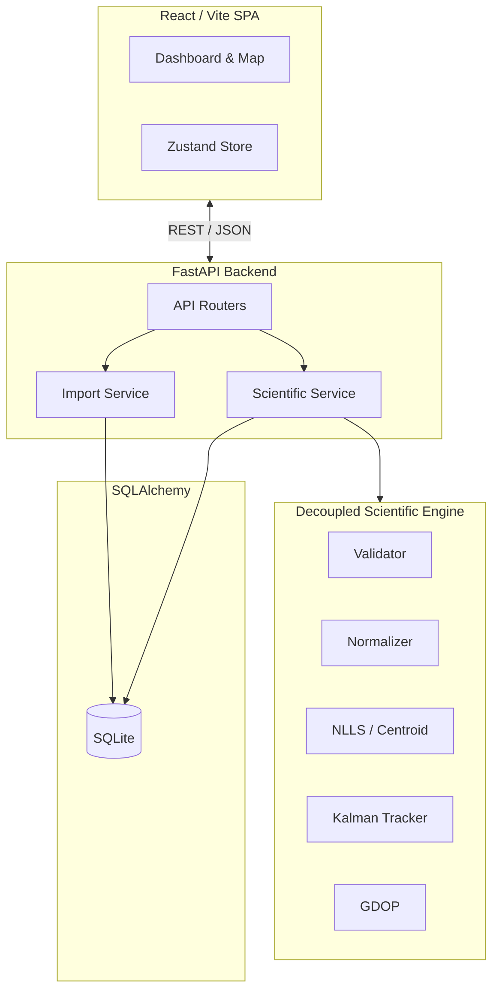

# System Architecture

Asterion utilizes a **Layered Modular Monolith Architecture**, emphasizing the separation between web application delivery and core scientific computing.

## High-Level Diagram

## Component Overview

### Frontend
- **React 19** Single Page Application.
- **Vite** for fast compilation and bundling.
- **Zustand** for lightweight, predictable state management.
- **Leaflet & React-Leaflet** for rendering interactive geospatial heatmaps, towers, and trajectory tracks.
- **Tailwind CSS 4** for responsive, modern UI design.

### Backend
- **FastAPI** handles REST routing and asynchronous execution.
- **Repository-Service-Router Pattern** ensures clean separation of concerns:
  - **Routers** parse incoming requests and delegate to Services.
  - **Services** orchestrate business logic and pipeline calls.
  - **Repositories** handle all SQLite read/writes via SQLAlchemy.

### Decoupled Scientific Engine
- The `scientific/` package operates entirely independently of FastAPI, meaning it can be invoked in Jupyter Notebooks or batch processing scripts.
- Relies on **NumPy** and **SciPy** for heavily vectorized NLLS optimization and covariance modeling.

### Database
- **SQLite** is used as the underlying persistence layer for zero-configuration hackathon deployments.
- **Alembic** manages schema migrations.
- **Pydantic V2** enforces strict serialization/deserialization between the API edge and the ORM.

## Workflow Execution

1. **Ingestion**: Raw telecom datasets are parsed, validated against operator standards (Airtel, BSNL, Jio, Vi), and seeded into SQLite.
2. **Localization**: The scientific service pulls validated measurements, groups them chronologically, and attempts Non-Linear Least Squares. If rank is deficient, it falls back to a Quality-Weighted Centroid.
3. **Tracking**: The Kalman filter applies 2D constant velocity estimation to smooth sporadic coordinate jumps.
4. **Evidence Generation**: Processed data is hashed via SHA-256 for integrity verification, and reports are served to the frontend.
